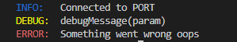

<!-- Project Shields -->


---

<!-- Table of Contents -->

## Built with

- [Nodejs](https://nodejs.org/en/)

## Use package

1. `npm i @llath/logger`

## Example

```javascript
const { log } = require("@llath/logger");
log("Connected to PORT", "info");
log("debugMessage(param)", "debug");
log("Something went wrong oops", "error");
```



---
